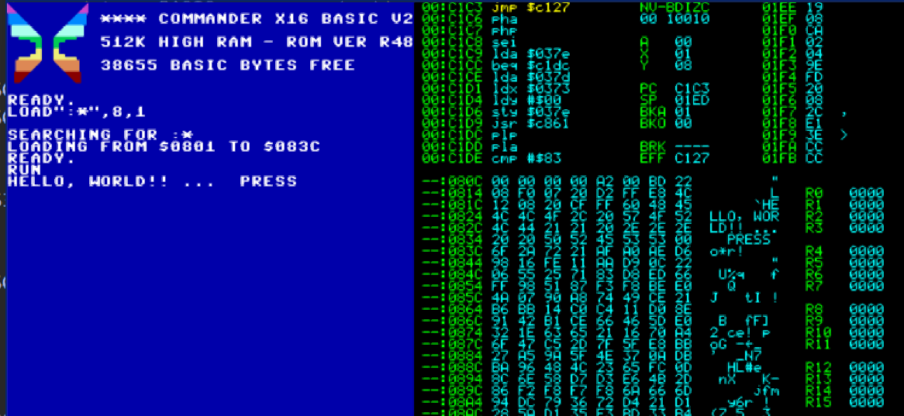

# Commander x16 and retro assembler

## Introduction

These are instructions for using retro assembler and visual studio code for coding on Commander x16 emulator. 

## Setup

refer to [SetupRetroAssembler](SetupRetroAssembler.md)

Visual Studio Code Editor - [found here](https://visualstudio.microsoft.com/)

## Debugging

for debugging instructions refer to [debugging](debugging\Debugger.md)

## Contributing 

read information on [contributing](CONTRIBUTING.md)

## Support

[Help support by buying some merchandise](https://cavtronics-3.creator-spring.com/)

